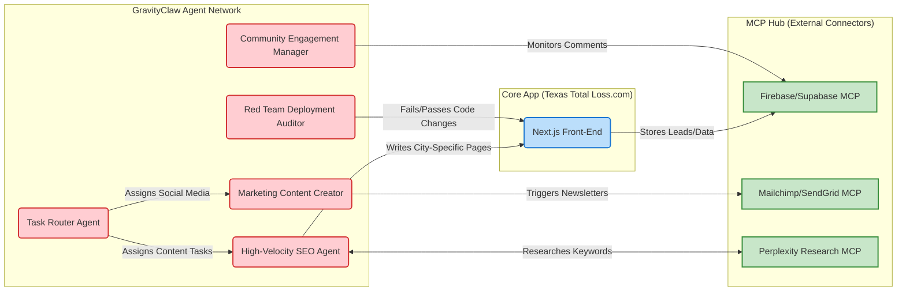
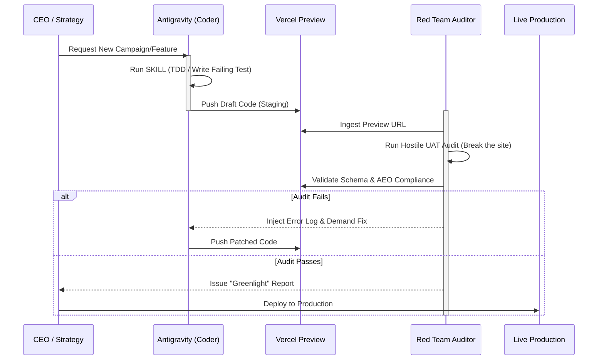

# Texas Total Loss (TTL) - Visual System Architecture & Workflows

This document contains dynamic infographics mapping out the exact logic, agent interactions, API connections, and marketing funnels for the Texas Total Loss system. 

*(Note: These can be embedded directly into your Admin Dashboard later using a React-Mermaid library, but for now, you can view the visual diagrams right here in this file using a Markdown Preview extension.)*

---

## 1. Organic Acquisition & Lead Funnel (The Marketing Campaign View)
This flowchart shows how a user discovers TTL organically via Answer Engine Optimization (AEO), engages with the tools, and is packaged into a high-quality case for a partner firm.

```mermaid
graph TD
    %% Styling
    classDef user fill:#e1f5fe,stroke:#0288d1,stroke-width:2px;
    classDef website fill:#f3e5f5,stroke:#7b1fa2,stroke-width:2px;
    classDef backend fill:#e8f5e9,stroke:#388e3c,stroke-width:2px;
    classDef crm fill:#fff3e0,stroke:#f57c00,stroke-width:2px;

    %% Funnel Steps
    U1[User asks AI "Car Totaled Insurance Lowball"]:::user
    AI[Gemini/ChatGPT/Google Cites TTL Answer-Box]:::user
    
    A1[Lands on TTL 'Settlement Offer Checker']:::website
    A2[User inputs VIN & Offer Amount]:::website
    
    API1((NADA/KBB Valuation API)):::backend
    
    A3{Is Offer Fair?}:::website
    
    A4[Offer is LOW: Triggers 'Coverage Eligibility Quiz']:::website
    A5[Quiz: Asks Injury & Fault Questions]:::website
    
    B1{Commitment Point: Name & Phone}:::website
    
    B2[Generates Dynamic 'Total Loss Action Plan PDF']:::website
    
    DB[(Supabase / Postgres)]:::backend
    
    S1[Lead Scoring Engine Analyzes Case]:::backend
    
    H1{Priority Score > 70?}:::backend
    
    C1[Webhook -> Litify/Salesforce CRM CRM Payload]:::crm
    C2[Automated SMS to User: 'Firm is reviewing your case...']:::crm
    
    %% Connections
    U1 --> AI
    AI --> A1
    A1 --> A2
    A2 <--> API1
    A2 --> A3
    A3 -->|Yes| A4
    A4 --> A5
    A5 --> B1
    B1 -->|Consent Given| B2
    B1 -->|Consent Given| DB
    DB --> S1
    S1 --> H1
    H1 -->|Hot Lead: BI/UM| C1
    C1 --> C2
```

---

## 2. Global Agent & MCP Integration Map
This diagram maps out how the different GravityClaw Agents and MCP Connections interact to power the marketing, content, and development of the platform.



---

## 3. The Quality Assurance (QA) & Deployment Loop
Every new feature, automation, or page must pass through this Hostile Clinical Audit before it hits production, minimizing technical debt.



---

## 4. Admin Dashboard View Blueprint (Future Implementation)
To directly answer your question: Right now, this lives natively in the GravityClaw Hub files. However, we can build a new tab in your `admin/content` Next.js Dashboard called **"Campaign War Room"** that automatically renders these interactive diagrams in the browser using `React-Mermaid2`.

### Proposed Dashboard Schema:
*   **Tab 1: Live Campaign Flows:** (Visuals of the current funnel, similar to Diagram 1, but with live conversion metrics superimposed on the nodes: *e.g., "54 users currently at Quiz step"*).
*   **Tab 2: Agent Health:** Green/Red status dots showing if the SEO Agent, Content Agent, and Red Team Auditor are active, sleeping, or errored out.
*   **Tab 3: UAT / QA Console:** A feed of the `Red Team Deployment Auditor` log, showing exactly what it tested and signed off on today.
